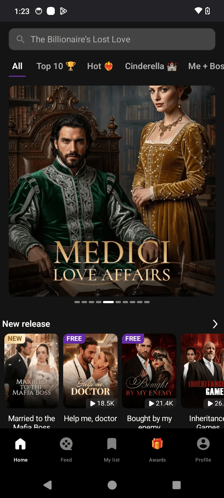

# 🎬 Reels Pix
Reels Pix is a modern, premium Android application that serves as a video streaming and discovery platform. It features an integrated wallet system, transaction tracking, and gamification through awards, offering a highly interactive user interface built entirely with Jetpack Compose.

## 📱 App Demo 
<p align="center">
  
</p>

## 📱 Features & Core Screens

### 1. ✨ Onboarding & Authentication
*   **Language Selection:** Tailored content based on the user's preferred language (`LanguageScreen`).
*   **Sign In:** Seamless authentication flow to securely access the app (`SignInScreen`).

### 2. 🎬 Reels Feed & Content Discovery
* **Immersive Reels Feed:** Full-screen vertical video experience designed for seamless short-form content discovery (`FeedScreen`).
* **Personalized Content:** Discover engaging reels based on categories, trending content, and curated video collections.
* **Smooth Playback:** Auto-playing videos with optimized transitions and an uninterrupted scrolling experience.
* **Explore & Search:** Discover videos, series, and categories through a dedicated search experience (`SearchScreen`, `CategoryDetailScreen`).
* **Interactive Content:** Engage with reels through likes, comments, sharing, and contextual actions.
* **Dedicated Video Player:** Rich, immersive playback experience with custom controls and supporting UI components (`VideoPlayerScreen`).

### 3. 💳 Wallet & Transactions
*   **My Wallet:** Dashboard showing the current balance and financial metrics (`MyWalletScreen`).
*   **Top-Up Flow:** Interactive bottom sheet to seamlessly add funds to the wallet (`TopUpBottomSheetContent`).
*   **Transaction History:** Detailed log of past top-ups, earnings, and expenditures (`TransactionHistoryScreen`).

### 4. 🏆 Profile & Gamification
*   **User Profile:** Personal dashboard for managing account settings (`ProfileScreen`).
*   **Awards System:** Gamified rewards tracking for user engagement (`AwardsScreen`).
*   **My List:** Personalized list of saved or favorite videos (`MyListScreen`).
*   **Invitation Code:** Referral system for inviting friends to the platform and earning rewards (`InvitationCodeScreen`).

## 🛠️ Architecture & Tech Stack
The application leverages the absolute best practices of modern Android development:

| Component | Library / Framework | Description |
| :--- | :--- | :--- |
| **UI Framework** | Jetpack Compose | Declarative UI rendering for Android. |
| **Navigation** | Navigation Compose | Android's official declarative routing engine. |
| **Dependency Injection** | Koin | Lightweight dependency injection framework. |
| **Networking** | Retrofit & OkHttp | HTTP client for async networking and API calls. |
| **Local Storage** | DataStore | Key-value data persistence for preferences. |
| **Image Loading** | Coil | Fast, lightweight image loading for Compose. |

## 🚀 How to Run the Application

### Prerequisites
*   Android Studio / IntelliJ IDEA with Kotlin plugin installed
*   JDK 17+

### 🤖 Running the App
1.  Open the root project in **Android Studio**.
2.  Select `app` in the configuration selector.
3.  Click the **Run** button (Shift + F10) or run the following Gradle command from the root directory:
    ```bash
    ./gradlew :app:installDebug
    ```

## 📂 Project Structure
```text
.
├── app/
│   ├── src/
│   │   ├── main/
│   │   │   ├── java/com/example/reels_pix/
│   │   │   │   ├── base/        # Base application components
│   │   │   │   ├── data/        # API client definition (Retrofit) and Models
│   │   │   │   └── ui/          # UI Screens (Compose)
│   │   │   │       ├── dashboard/   # Core app screens (Feed, Wallet, Video, etc.)
│   │   │   │       └── theme/       # App typography, colors, and custom styling
└── gradle/                  # Build scripts and version catalogs (libs.versions.toml)
```
